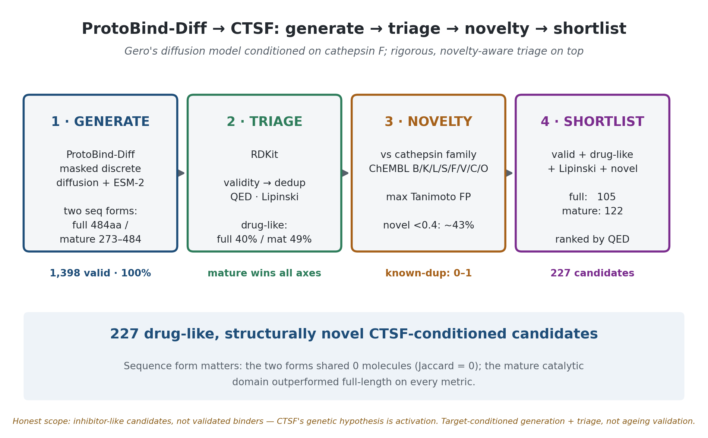

# ProtoBind-Diff → CTSF: target-conditioned ligand generation with leakage-aware triage

Generating candidate ligands for **cathepsin F (CTSF)** with Gero's open-source
diffusion model **[ProtoBind-Diff](https://github.com/gero-science/ProtoBind-Diff)**,
then triaging them with a rigorous, novelty-aware pipeline. CTSF was nominated as
a putative ageing-causal gene by an MR-anchored multi-omic model
([companion work](https://github.com/cgjuan01/Causal-deep-learning-GNN-multi-omic))
and characterised for binding-affinity tractability in a
[leakage-aware affinity study](https://github.com/cgjuan01/protein-ligand-binding-affinity-ageing-targets).

> **Honest scope.** The generated molecules are **inhibitor-like** (nitrile-warhead
> chemistry that engages the catalytic cysteine of papain-family proteases), whereas
> the genetic hypothesis for CTSF is **activation**. This is therefore a demonstration
> of *target-conditioned generation + rigorous triage*, **not** ageing validation.
> "Generated + novel" is **not** "validated binder": true affinity requires docking
> (e.g. Boltz-1, as in the ProtoBind-Diff paper) or experimental assay. Every
> molecule here is a *candidate*.

---

## What this does

1. **Generate.** Run ProtoBind-Diff (a masked discrete-diffusion language model that
   emits SMILES conditioned on an ESM-2 protein-sequence embedding) on CTSF, in two
   sequence forms:
   - **full-length** canonical preproprotein (UniProt Q9UBX1, 484 aa)
   - **mature catalytic domain** (residues 273–484; contains the catalytic-Cys motif `CGSCWAFS`)
2. **Triage** (RDKit): validity, canonical de-duplication, drug-likeness (QED, Lipinski).
3. **Novelty** against the cathepsin-family chemical space (ChEMBL: CTSB/K/L/S/F/V/C/O):
   max Tanimoto on Morgan fingerprints; flag near-duplicates (≥0.99) and novel (<0.4).
4. **Shortlist**: valid + drug-like + Lipinski-compliant + novel.

The generator is Gero's; the contribution here is the **rigorous triage**, the
**novelty filter against the real cathepsin chemical space**, and a
**within-condition control that exposed an apparent sequence-form effect as a sampling artifact**.

---

## Results

Generation: 250 sampling steps, up to 1,000 molecules per sequence form on a single
T4 GPU.

| metric | full-length (484 aa) | mature domain (273–484) |
|---|---|---|
| valid, unique molecules | 716 | 682 |
| chemical validity | 100% | 100% |
| drug-like (QED ≥ 0.5) | 287 (40%) | 334 (49%) |
| Lipinski-pass | 412 (58%) | 435 (64%) |
| mean QED | 0.469 | 0.500 |
| mean MW | 453 | 437 |
| mean logP | 3.61 | 3.34 |
| novel vs cathepsin space (<0.4 Tanimoto) | 324 | 279 |
| near-duplicate of known (≥0.99) | 0 | 1 |
| **drug-like + novel shortlist** | **105** | **122** |

**Total shortlist: 227 drug-like, novel, CTSF-conditioned candidates.**

*Note: the full-vs-mature differences in the table above are within the model's run-to-run
sampling variability (see Findings) and should not be read as a sequence-form effect.*

### Findings

- **100% chemical validity** across ~1,400 molecules — the discrete-diffusion
  generator produces parseable structures reliably.
- **Target-aware chemistry.** Generated molecules are dominated by **nitrile warheads**
  and peptidomimetic backbones — the canonical motif of cysteine-protease inhibitors —
  despite the model receiving only the protein sequence.
- **The apparent sequence-form effect is a sampling artifact (cautionary result).**
  A naive comparison looked striking: full-length and mature CTSF appeared to share almost
  no chemistry, which could suggest that sequence form strongly shapes the output. But a
  **within-condition replicate control** (generating each form twice with different seeds)
  dissolved it: two runs of the same sequence differ just as much as the two forms do
  (scaffold Jaccard within-form 0.033 vs between-form 0.031; property-distribution
  Wasserstein within-form 0.093 vs between-form 0.096). The model's sampling stochasticity
  fully accounts for the apparent difference, so there is no detectable sequence-form
  effect once the noise floor is controlled for. Reported here as a methodological caution:
  comparisons of stochastic generative-model outputs need a within-condition baseline, or
  sampling diversity will be mistaken for a conditioning effect.
- **Genuine novelty.** Near-zero regeneration of known compounds (0–1 at ≥0.99) and
  ~43% novel vs the entire cathepsin-family chemical space; the model is producing new
  chemical matter, not memorised analogues.

---

## Reproduce

Open `ProtoBindDiff_CTSF_Colab.ipynb` in Google Colab, set Runtime → GPU, run top to bottom.

Key environment notes (Colab, 2026):
- ProtoBind-Diff's checkpoint predates PyTorch 2.6's `weights_only=True` default; the
  notebook allowlists the needed globals / loads with `weights_only=False` (the
  checkpoint is from Gero's official HF repo — a trusted source).
- ProtoBind-Diff pins `numpy==1.26.4`; the RDKit triage needs numpy ≥ 2, so the
  notebook upgrades numpy and restarts the runtime *after* generation (the generated
  files persist on disk).

### Sequences
- CTSF canonical: UniProt **Q9UBX1** (484 aa).
- Mature domain: residues 273–484 (catalytic motif `CGSCWAFS`; LSBio construct boundary).

### Novelty reference
- **Now:** cathepsin-family actives pulled live from the ChEMBL API (8 targets).
- **Swap-in (Option B):** set `REFERENCE_CSV` to a harmonised, leakage-audited cathepsin
  SMILES set (e.g. exported from the affinity repo's `merge_sources.py`) and re-run —
  one line. Recommended for a fully rigorous novelty claim, since BindingDB re-distributes
  ChEMBL and a naive pull double-counts.

---

## Files

| file | contents |
|---|---|
| `ProtoBindDiff_CTSF_Colab.ipynb` | end-to-end notebook (generate → triage → novelty → shortlist) |
| `ctsf_generated_triaged.csv` | all valid/unique generated molecules with properties + novelty scores |
| `ctsf_novel_shortlist.csv` | the 227 drug-like + novel candidates |
| `gen_full.txt`, `gen_mature.txt` | raw generated SMILES per sequence form |
| `ctsf_full.fasta`, `ctsf_mature.fasta` | the two conditioning sequences (provenance) |

---

## Credit & licence

- **ProtoBind-Diff**: Mistryukova, Manuilov, Avchaciov, Fedichev et al., Gero
  (bioRxiv 2025; repo `gero-science/ProtoBind-Diff`, CC BY-NC 4.0). The generative model
  is theirs; this repo only runs it and adds triage/novelty analysis.
- This work: triage, novelty filtering, and the within-condition sampling-artifact control - for
  research / portfolio demonstration, non-commercial.
